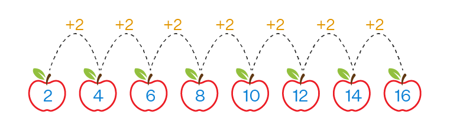
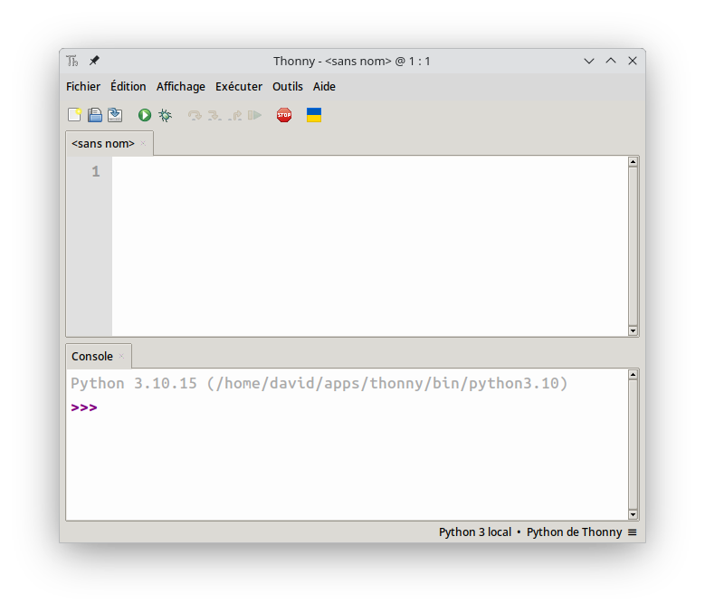
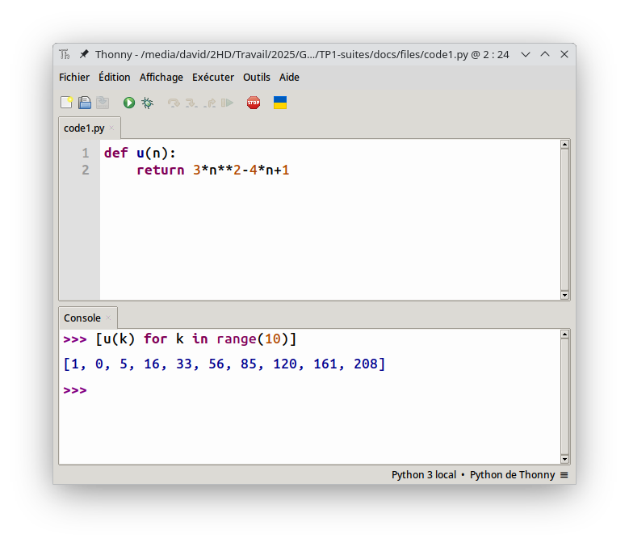
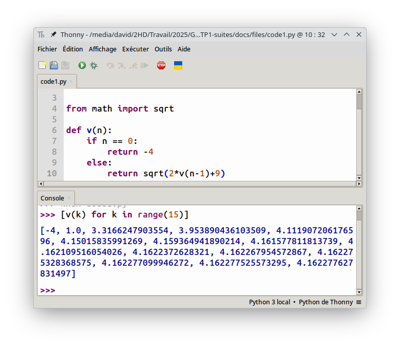
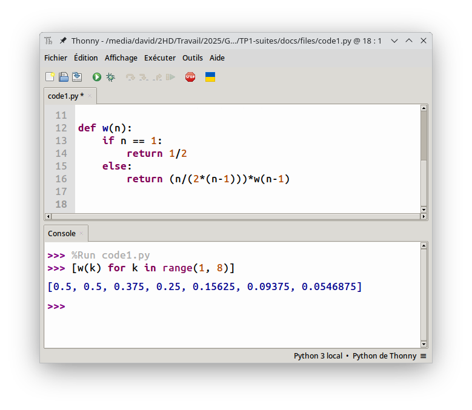

# Générer des suites en informatique

Les suites mathématiques sont des objets qui répondent à des règles simples permettant de les générer.  
On retrouve par exemple :

- une formule explicite ;
- une formule récurrente ;
- une formule utilisant une autre suite ;
- etc.

<center>
    
</center>

Dans ce TP, on apprend à générer des suites sur tableur et en Python afin d'observer leur comportement à l'infini.

## Avec un tableur

### Pour commencer

Les tableurs sont les logiciels le plus adaptés pour observer le comportement d'une suite.  
On s'intéresse ici aux trois suites $(u)$, $(v)$ et $(w)$ définies pour tout entier naturel $n$ par :

$$
u_n = n^2+n+41 \qquad\qquad \left\lbrace\begin{array}{lcl}v_0&=&1\\ v_{n+1}&=&2-3v_n\end{array}\right. \qquad\qquad \left\lbrace\begin{array}{lcl}w_0&=&5\\ w_{n+1}&=&w_n-4n^2+1\end{array}\right.
$$

!!! bug "Vocabulaire"

    La suite $(u)$ est dite **explicite** alors que $(v)$ est dite **récurrente**. La suite $(w)$ est plutôt considérée comme **récurrente**.

!!! note "Quelques manipulations"

    1. Ouvrez le logiciel **LibreOffice Calc**
    <center>
        
    </center>
    2. Reproduire le tableau ci-dessous avec la valeur de $n$ qui varie de 0 jusque 100.
    <center>
        
    </center>
    3. Dans la cellule $B2$ (concernant la suite $(u)$), saisissez la formule $\fbox{=PUISSANCE(A2;2)+A2+41}$ puis validez.
    4. Étirez cette formule en double cliquant sur le petit carré en bas à droite de cette cellule.
    <center>
        
    </center>
    5. De la même façon entrez la valeur associée à $v_0$ dans la cellule $C2$ puis saisissez la formule $\fbox{=2-3*C2}$ dans la cellule $C3$.
    6. Entrez la valeur associée à $w_0$ dans la cellule $D2$ puis saissisez la formule $\fbox{=D2-4*PUISSANCE(A2;2)+1}$ dans la cellule $D3$.

### À vous de jouer

On considère les suites $(u)$, $(v)$ et $(w)$ définies pour tout entier naturel $n$ par :

$$
u_n = 3^n+n-1 \qquad\qquad \left\lbrace\begin{array}{lcl}v_0&=&0\\ v_{n+1}&=&3v_n-2n+3\end{array}\right. \qquad\qquad w_n = v_n-n+1
$$

1. Réalisez un tableur générant les dix premiers termes de ces trois suites.

## Avec Python

### Pour commencer

Le langage Python est un atout informatique pour sa praticité et sa capacité à effectuer des calculs importants.

<center>
    
</center>

!!! tip

    En python, pour définir une suite on utilise la notion de fonction.

On considère les suites $(u)$, $(v)$ et $(w)$ définies pour tout entier naturel $n$ par :

$$
u_n = 3n^2-4n+1 \qquad\qquad \left\lbrace\begin{array}{lcl}v_0&=&-4\\ v_{n+1}&=&\sqrt{2v_n+9}\end{array}\right. \qquad\qquad \left\lbrace\begin{array}{lcl}w_1&=&\frac{1}{2}\\ w_{n+1}&=&\frac{n+1}{2n}w_n\end{array}\right.
$$

Pour les suites explicites comme $(u)$, il est très simple d'utiliser le langage Python :

!!! note "Quelques manipulations"

    1. Ouvrez le logiciel Thonny
    <center>
        
    </center>
    2. Dans la zone de script (partie supérieure du logiciel), écrivez le code :

        ``` python title="Implantation de la suite u" linenums="1"
        def u(n):
            return 3*n**2-4*n+1
        ```
    3. Enregistrez le fichier puis exécutez le grâce au bouton  
    4. Pour générer les dix premiers termes de la suite $(u)$, tapez dans la console (partie inférieure du logiciel), l'instruction `[u(k) for k in range(10)]`.
    <center>
        
    </center>

En python, il n'est possible que de générer des suites de la forme $u(n) = $ et non pas $u(n+1)$.  
Ainsi, pour la suite $(v)$ définie par : 

$$
\left\lbrace\begin{array}{lcl}v_0&=&-4\\ v_{n+1}&=&\sqrt{2v_n+9}\end{array}\right.
$$

il est d'abord nécessaire de la réécrire sous la forme :

$$
\left\lbrace\begin{array}{lcl}v_0&=&-4\\ v_{n}&=&\sqrt{2v_{n-1}+9}\end{array}\right.
$$

!!! info

    On a réalisé un décalage de l'indice. Le $n+1$ est devenu $n$ et donc le $n$ est devenu $n-1$.

!!! note "Quelques manipulations"

    1. À la suite du code précédent, tapez le code suivant :

        ``` python title="Implantation de la suite v" linenums="1"
        from math import sqrt

        def v(n):
            if n == 0:
                return -4
            else:
                return sqrt(2*v(n-1)+9)
        ```
    2. Pour générer les quinze premiers termes, tapez dans la console `[v(k) for k in range(15)]`.
    <center>
        
    </center>

Pour la suite $(w)$ définie par :

$$
\left\lbrace\begin{array}{lcl}w_1&=&\frac{1}{2}\\ w_{n+1}&=&\frac{n+1}{2n}w_n\end{array}\right.
$$

il faut faire attention au fait que le premier terme est $w_1$ et non pas $w_0$.  
De plus, il faudra bien décaler tous les indices pour générer la bonne suite. En effet, $(w)$ devient après décalage :

$$
\left\lbrace\begin{array}{lcl}w_1&=&\frac{1}{2}\\ w_{n}&=&\frac{(n-1)+1}{2(n-1)}w_{n-1} = \frac{n}{2(n-1)}w_{n-1}\end{array}\right.
$$

!!! note "Quelques manipulations"

    1. À la suite du code précédent, tapez le code suivant :

        ``` python title="Implantation de la suite w" linenums="1"
        def w(n):
            if n == 1:
                return 1/2
            else:
                return (n/(2*(n-1)))*w(n-1)
        ```

        !!! warning

            Remarquez que dans le bloc conditionnel, on a bien `if n == 1` pour la gestion de $w_1$.

    2. Générez les sept premiers termes grâce à l'instruction `[w(k) for k in range(1, 8)]`
    <center>
        
    </center>

### À vous de jouer

On s'intéresse aux suites définies pour tout entier naturel par :

$$
u_n = \left(1+\frac{1}{n}\right)^n \qquad \qquad \left\lbrace\begin{array}{lcl}v_0&=& 1\\v_1 & = & 1\\ v_{n+1}&=&v_n+v_{n-1}\end{array}\right. \qquad\qquad
\left\lbrace\begin{array}{lcl}x_0&=&200\\y_0&=&50\\ x_{n+1}&=&1,05x_n-0,001x_ny_n\\
y_{n+1}&=&0,97y_n+0,0002x_ny_n\end{array}\right.
$$

1. Écrivez un script permettant de définir ces trois suites puis générez les douze premiers termes de chacune d'entre elles.