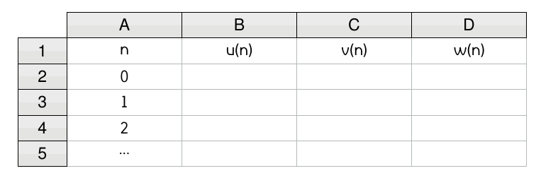

# Générer des suites en informatique

Les suites mathématiques sont des objets qui répondent à des règles simples permettant de les générer.  
On retrouve par exemple :

- une formule explicite ;
- une formule récurrente ;
- une formule utilisant une autre suite ;
- etc.

    

Dans ce TP, on apprend à générer des suites sur tableur et en Python afin d'observer leur comportement à l'infini.

## Avec un tableur

Les tableurs sont les logiciels le plus adaptés pour observer le comportement d'une suite.  
On s'intéresse ici aux trois suites $(u)$, $(v)$ et $(w)$ définies pour tout entier naturel $n$ par :

$$
u_n = n^2+n+41 \qquad\qquad \left\lbrace\begin{array}{lcl}v_0&=&1\\ v_{n+1}&=&2-3v_n\end{array}\right. \qquad\qquad \left\lbrace\begin{array}{lcl}w_0&=&5\\ w_{n+1}&=&w_n-4n^2+1\end{array}\right.
$$

!!! bug "Vocabulaire"

    La suite $(u)$ est dite **explicite** alors que $(v)$ est dite **récurrente**. La suite $(w)$ est plutôt considérée comme **récurrente**.

!!! note "Quelques manipulations"

    1. Ouvrez le logiciel **LibreOffice Calc**
    

        
    

    2. Reproduire le tableau ci-dessous avec la valeur de $n$ qui varie de 0 jusque 100.
    

        
    

    3. Dans la cellule $B2$ (concernant la suite $(u)$), saisissez la formule $\fbox{=PUISSANCE(A2;2)+A2+41}$ puis validez.
    4. Étirez cette formule en double cliquant sur le petit carré en bas à droite de cette cellule.
    

        
    

    5. De la même façon entrez la valeur associée à $v_0$ dans la cellule $C2$ puis saisissez la formule $\fbox{=2-3*C2}$ dans la cellule $C3$.
    6. Entrez la valeur associée à $w_0$ dans la cellule $D2$ puis saissisez la formule $\fbox{=D2-4*PUISSANCE(A2;2)+1}$ dans la cellule $D3$.

## Avec Python

## Pour aller plus loin